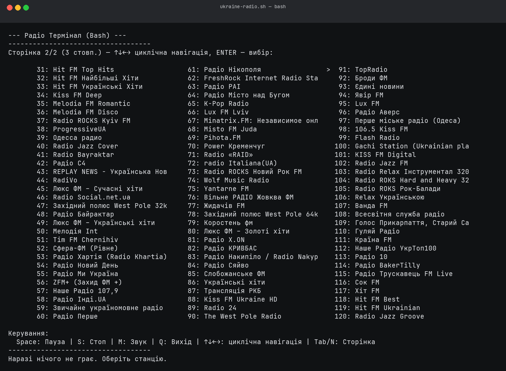

# 🎧 Radio-Bash — українське інтернет-радіо у вашому терміналі

**Radio-Bash** — Bash-скрипт для простого інтерактивного прослуховування десятків онлайн-радіостанцій України через mpv.



## 🚀 Швидкий старт

1. Встановіть [mpv](https://mpv.io/) (необхідний для програвання потоків).
2. Надати права на виконання:
   ```bash
   chmod +x ukraine-radio.sh
   ```
3. Запустіть скрипт:
   ```bash
   ./ukraine-radio.sh
   ```

## 🎵 Можливості

- Великий вибір станцій:  
  120 українських радіостанцій, розподілених між сторінками й стовпчиками.
- **Адаптивна сітка стовпчиків:**  
  Кількість видимих стовпчиків і рядків автоматично підлаштовується під
  поточний розмір вікна термінала (`tput lines`/`tput cols`). При зміні
  розміру вікна (WINCH) розкладка перераховується, тож меню вписується в
  екран без обрізання.
- Зручне меню управління у терміналі:
  - Навігація стрілками ↑↓←→ — **циклічна**. ↑↓ переміщають вибір у межах
    стовпчика, а ←→ переходять між усіма стовпчиками. Коли вибір доходить до
    краю видимої області, список плавно прокручується на один стовпчик; на
    межі списку стовпчики циклічно з'єднані. Меню оновлюється без повного
    очищення екрана, тож не блимає при навігації.
  - `Tab` або `N` — циклічне перемикання між сторінками
  - Enter — запуск станції
  - Введення номера станції (1-120) одразу запускає її
  - `Space` або `P` — пауза/відновлення потоку
  - `M` — вкл./викл. звук
  - `S` — зупинка
  - `Q` — вихід з програми
- Стан поточного потоку:  
  Показує, яка станція грає, чи стоїть на паузі, чи вимкнено звук.
- Кольорова підсвітка (опціонально).

Список потоків оновлено 21.09.2026. Адреси відібрано з актуальних MP3/AAC-потоків
Radio Browser; окремі станції можуть бути тимчасово недоступні через роботу
стримінгових серверів.

## 🛠️ Вимоги

- Bash (сучасний, із підтримкою функцій tput)
- [mpv](https://mpv.io/)
- (Опційно) [socat](https://linux.die.net/man/1/socat) для сокет-команд до mpv

## 📗 Ліцензія

Випущено у публічному доступі (Public Domain, [Unlicense](https://unlicense.org/)).  
Можна вільно копіювати, змінювати, розповсюджувати та використовувати у комерційних і некомерційних цілях.

---

> Проект створено з любовʼю для всіх, хто цінує українську музику та хоче слухати радіо без браузера!
